# Faculty Consultation Software
The idea was to create a computer kiosk inside university. In this way, it will be easier for students to talk to any faculty members of the university. There are two types of account: **Student's account** and the **Professor's account**. Both accounts are organized and will keep the consultation easier.

# Features

## Login
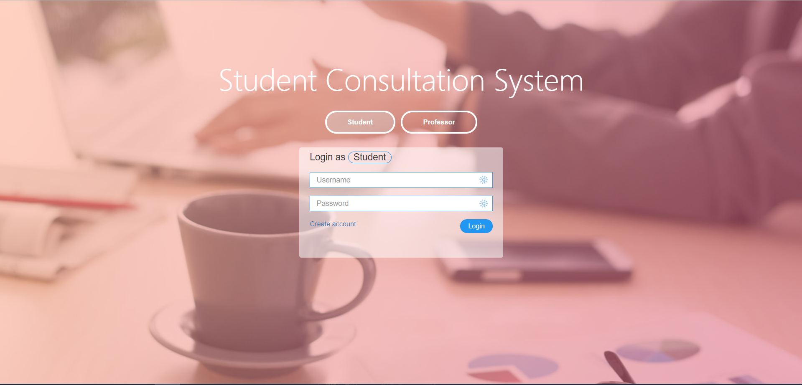

## Signup
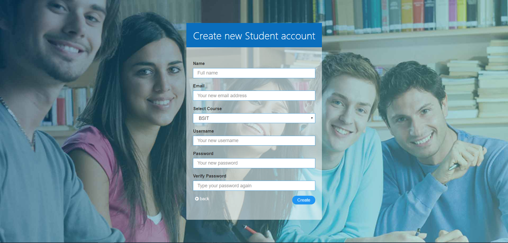

## Update Account
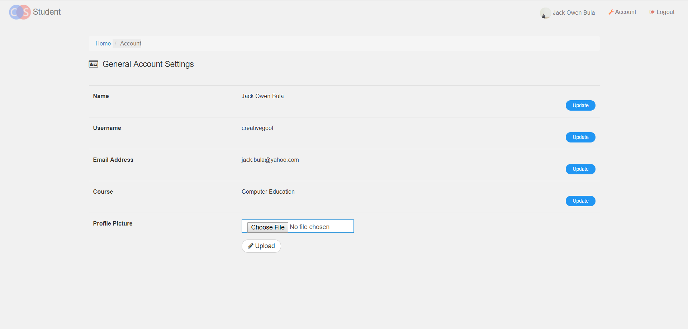

## Student's Page
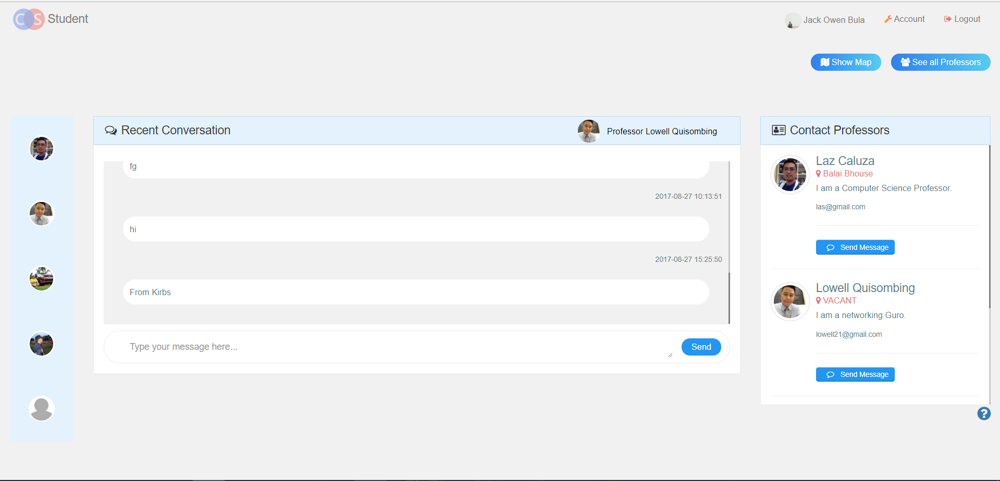

## Message 
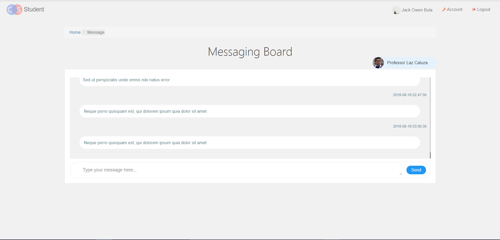

## Map
Simple map of the university and its buildings in marker.
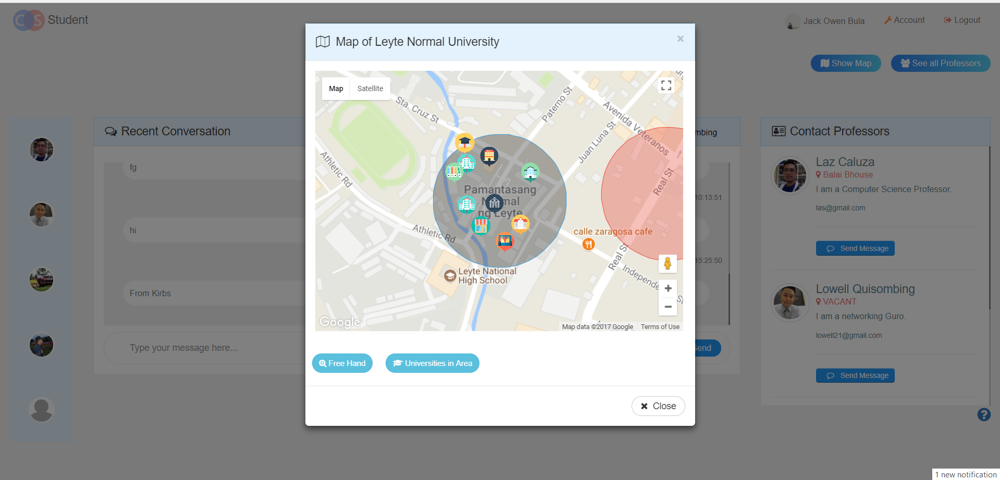

## Street View
Available streetview for the actual map.
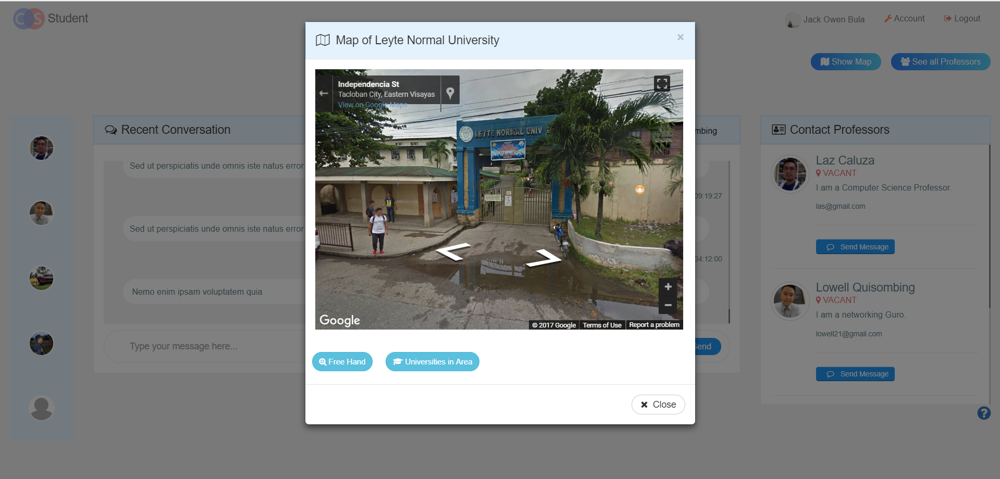

## Departments
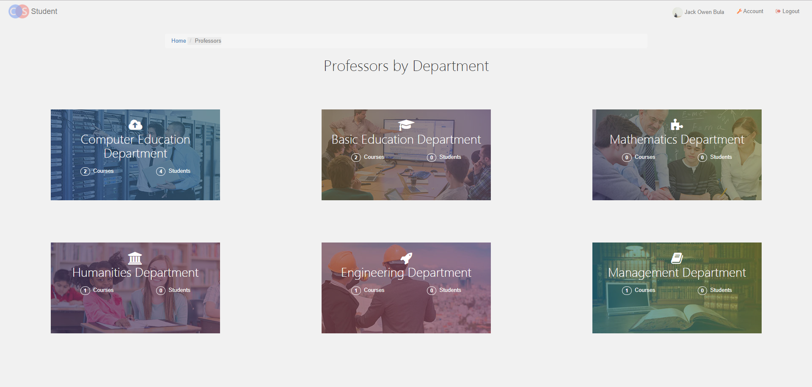

## Current Department
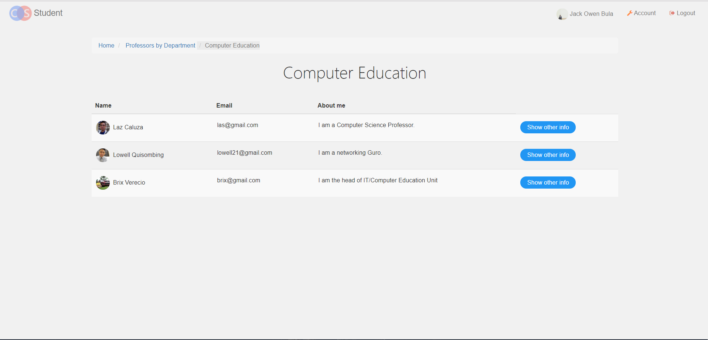

## Professor's Info
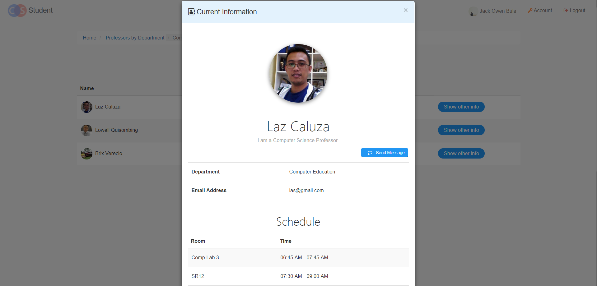

## Professor's Page
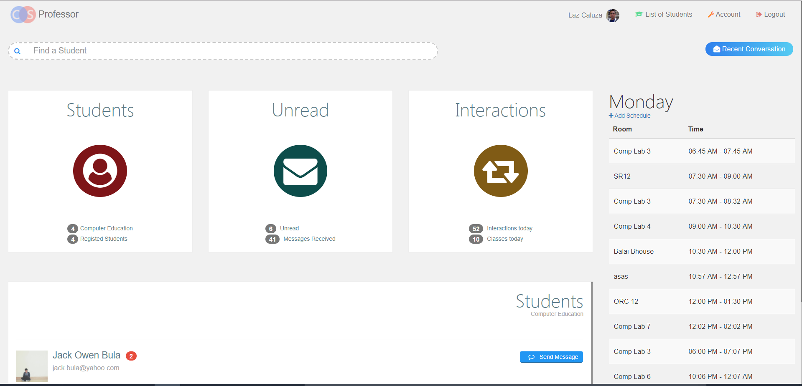

## Adding Professor's Schedule
The schedule will make student know where you are at the current moment.
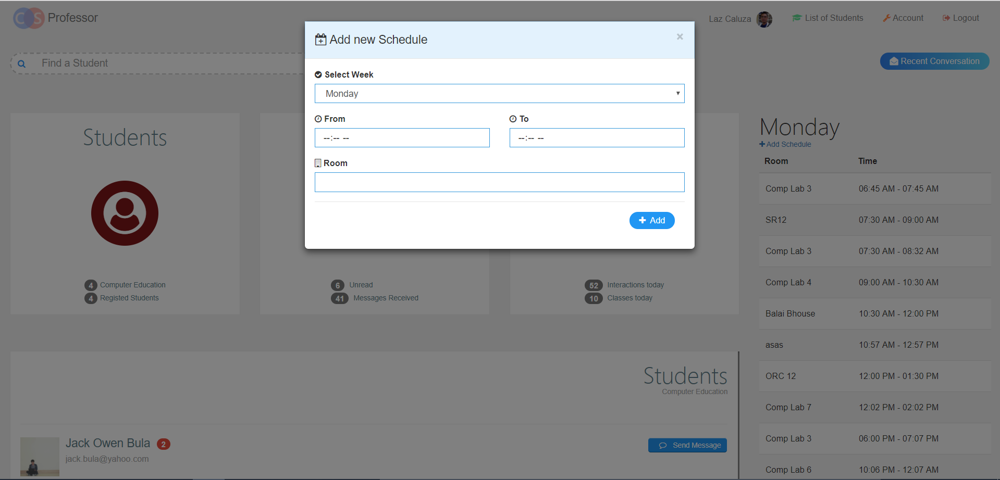

## List of Students by Course
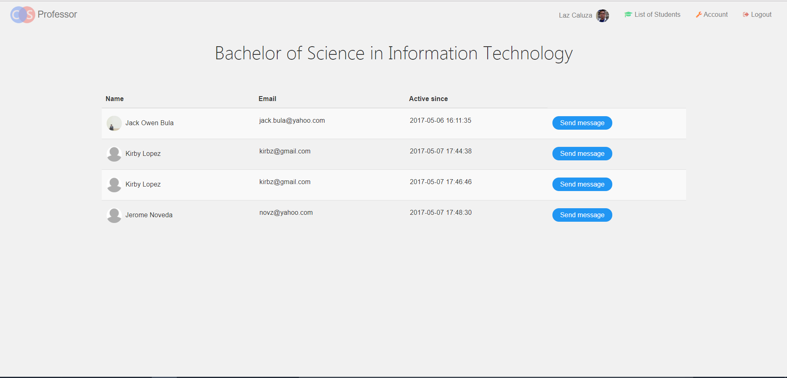